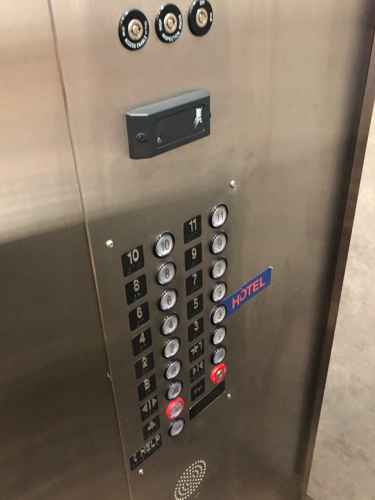
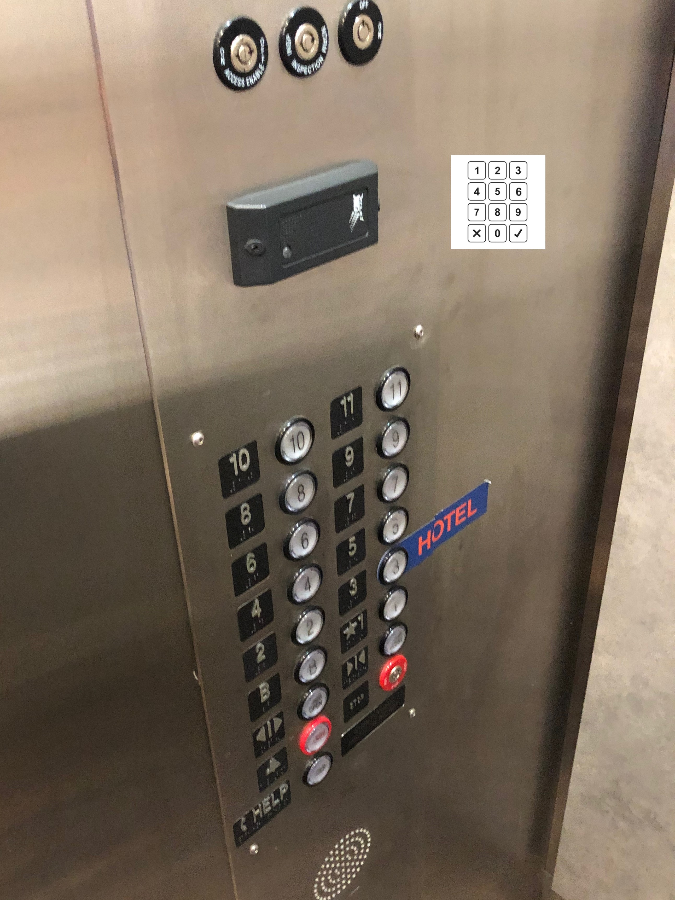

# Elevator

https://natezxc.github.io/Elevator/
## C:
* This elevator is located at the Pioneer Apartments and Hotel on Broadway and K avenue.
 
 

* The elevator's current design requires a resident key to use the elevator. This makes it hard for hotel guests or even residents if they happen to misplace their keys to get to where they are trying to go.

* Without a key, hitting the elevator button will do nothing and the elevator will remain on the current floor. It is inconvient for the residents to have to take the elevator down to meet the guests just to bring them up to their apartment.

## B:

* An elevator's main function is to move from the user's current floor to their desired floor. To do that, the user presses buttons to call the elevator, choice their desired floor and even close or keep the elevator door open. A rare use of an elevator is the ability to call an operator if there is something wrong with the elevator or if the user gets stuck.

1. The normal sequence when using an elevator is to press the button of the direction you would like to go, whether up or down. This will call the elevator to your current floor.
2. The elevator doors will open when it arrives. The user will then step on. If the user is on the ground floor, he must use the apartment key and press the button of their desired floor. If not on the ground floor, the user can simply press the button of the desired floor. 
3. The elevator doors will then close and the elevator will move toward the floor selected. If more than one floor was pressed, the elevator will stop at the floor closest to the current floor (given that the floor selected is in the same direction as selected when calling the elevator) until it reaches the final selected floor. 
4. When the elevator arrives at the selected floor, the doors will open and the user step off the elevator.

* The elevator does not make it easy to figure out. When no key is provided, the elevator provides no feedback as to why the elevator is not travelling to the selected location. It simply acts like a button was not pressed. It is required to put a label so that people can find the hotel floor.
* Some common mistakes can be that the user thinks the elevator is broken because after pressing the button without the key, nothing happens.

* Like a gated community, a number pad could be added to ring a person to activate the elevator. To fix the feedback, the elevator should add a sign with instructions or add some visual that will show the an error in input.
